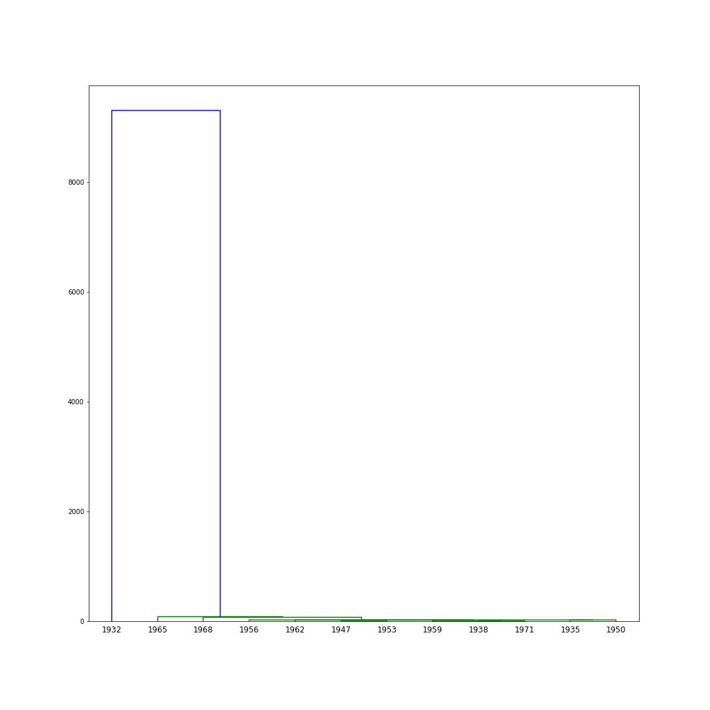

# Government Expenses Analysis

## Abstract
> This repo goal is to analyse the french government expenses between 1872 and 1971

## Notebook's code step

### 1. Importation of libraries used in this notebook

``` python
import pandas as pd
import numpy as np
import numpy.linalg as linalg
import matplotlib.pylab as plt
import warnings
warnings.filterwarnings('ignore')

from sklearn import *
import scipy.cluster.hierarchy as hi

from sklearn.cluster import KMeans

import seaborn as sns

from scipy.stats import norm
from scipy import stats
```

> I didn't import all the libraries at once, I imported them when I needed them

### 2. Dataset importation

``` python
df = pd.read_excel('depenses-etat2.xls')
data = df.values
ministeres = np.asarray(df.columns)
annees = np.asarray(df.index)
```
### 3. Scaling of the dataset using the **`preprocessing.scale`** function of the `Scikit-learn` library

``` python
data_scaled = preprocessing.scale(data)
```

### 4. **`cercle_corr`** function to create the circle correlation between a column and the other columns of the dataset

``` python
def cercle_corr(data,labels):
    val,P,comp=acp(data)
    plt.figure(figsize=(10,10))
    plt.xlim((-1,1))
    plt.ylim((-1,1))
    c1 = np.sqrt(val[0])*P[:,0]
    c2 = np.sqrt(val[1])*P[:,1]
    circle1=plt.Circle((0,0),radius=1, color='g', fill=False)
    fig = plt.gcf()
    fig.gca().add_artist(circle1)
    for i in range(c1.shape[0]):
        plt.plot([0,c1[i]],[0,c2[i]])
        plt.annotate(labels[i],(c1[i],c2[i]))
    plt.grid(True)
```

`cercle_corr` function used with the _ministeres_ column which contains the ministeres names


``` python
cercle_corr(data,ministeres)
```

`cercle_corr` function used with the _annees_ column which contains the years


``` python
cercle_corr(data,annees)
```

`scipy.cluster.hierarchy` **`ward`** classification function use case

``` python
hi.ward(data)
```

`scipy.cluster.hierarchy` **`dendogram`** hierarchical clustering function



### 5. Utilisation of the **_KMeans_** clustering method for the scaled data

Scatter of cluster centers


Scatter of the *data_scaled* dataset


### 6. Data Analysis with the **`seaborn`** library

**Heatmap**

``` python
f,ax = plt.subplots(figsize=(18, 18))
sns.heatmap(df.corr(), annot=True, linewidths=.5, fmt= '.2f',ax=ax)
plt.show()
```


**Pairplots**
``` python
first_six_columns = df.columns[0:6]
sns.pairplot(df[first_six_columns],height=2.5)
plt.savefig('first_six_pairplot.png')
plt.show()
```


``` python
first_six_columns = df.columns[0:6]
sns.pairplot(df[first_six_columns],height=2.5)
plt.savefig('first_six_pairplot.png')
plt.show()

```


6.a Distribution and distribution plots using the **`scipy`** library

6.b Creation of a new DataFrame with the log values of the dataframe

``` python
df_log = pd.DataFrame(np.log(df))
```